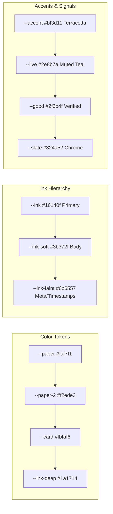

# IRIS UI Specification v1.0 — Comprehensive Deep Analysis Report

**Document Title:** IRIS — The Interface · Powered by EYES (IRIS UI Specification v1.0)  
**Author / Authority:** Abhi (Founder & CEO, EYES)  
**Scope:** All surfaces (Vision + v0 Build) · Ship-on-true execution  
**Target Codebase Alignment:** `e:\AI project\The EYES`  

---

## 1. Executive Summary & Core Philosophy

The **IRIS UI Specification v1.0** is the definitive design and interaction blueprint for IRIS, the cognitive interface sitting atop the EYES Understanding API. 

> **The Underlying Principle:**  
> *"Rendering without understanding is decoration. Every surface here renders understanding — which is the one thing no interface layer above us has."*

### Key Strategic Insights:
- **The Vendo Counter-Positioning:** YC S26 funded Vendo as an open-source agent layer that composes UI over software applications. However, Vendo has no memory of the person and resets context at product boundaries. IRIS composes what a **life** contains — with provable receipts.
- **Ship-on-True Methodology:** Features ship directly to production the hour they are true on real founder data. No arbitrary dates, no mock data, no finished-unshipped code.
- **Honest Empty State over Fabricated Full:** If data is absent, render a calm Fraunces statement + one action suggestion rather than fake metrics.

---

## 2. Token Architecture & Design System (§01)

The system strictly enforces a warm **Paper & Ink** design language (avoiding cold grey/navy):



### Typography System:
1. **Fraunces (Serif)** — Reserved exclusively for display headings, greetings, surface titles, and emotional beats.
2. **Inter (Sans-serif)** — The workhorse for all body copy, UI controls, and buttons.
3. **JetBrains Mono (Monospace)** — Signature font for evidence, timestamps, receipts, IDs, and uppercase mono-labels (`letter-spacing: 0.15–0.22em`). Monospace signals: *"This is provable."*

---

## 3. The Receipt-Depth Principle (§02)

The specification corrects an earlier design mistake ("citation chips on every claim"):

- **Default State:** Claims are clean prose. No badges or chips clutter the surface (chips signal anxiety).
- **Hover Affordance:** Hovering over a claim reveals a faint underline (`--accent-soft`), indicating proof exists underneath.
- **4-Layer Progressive Depth:**

```
[Clean Claim Surface] 
       │ (Click / Tap)
       ▼
Layer 1: The Source ───► Exact message/document metadata & timestamp
       │ (Drill Down)
       ▼
Layer 2: The Span ─────► Sentence highlighted (<mark> background: var(--accent-soft))
       │ (Drill Down)
       ▼
Layer 3: Full Record ──► Complete thread, confidence score & validity window
       │ (Drill Down)
       ▼
Layer 4: Lineage ──────► Historical belief chain, replaced beliefs & contradictions
```
*Exception:* On **Investigate**, proof IS the product, so inline receipts are rendered by design.

---

## 4. The 6 Core Surfaces (§04 – §10)

| Surface | Tense / Question | v0 Core Deliverables | Shared Components Used |
| :--- | :--- | :--- | :--- |
| **1. Desk (Brief)** | Present ("What matters now?") | Bento grid layout, Fraunces greeting, top 3 priorities, overnight changes, slipping check-ins, horizontal today now-strip, ambient pulse. | BentoGrid, S2 Cards, S4 Empty State, Recharts sparkline |
| **2. Workstation (Chat)** | Doing ("Help me do/think this") | Un-bubbled flowing prose in `--ink`, quiet right-aligned user prompts, Intent Cards (`SHOW` scope: commitments, slippage, changes), Push-to-Talk orb. | Vercel AI SDK (`useChat`), Motion stagger, S1 Receipt Panel |
| **3. Signals** | Flow ("What's happening around us?") | Visually-native feed (~680px max), auto-posts for decision-relevant events (>5 threshold), manual composer, meaning lines + thumbnails. | Magic UI `AnimatedList`, S2 Card variants, Recharts |
| **4. Timeline** | Past ("How did we get here?") | Vertical time machine axis, node stream, **superseded beliefs struck-through** with link to replacement, month ↔ day smooth zoom. | `react-chrono` / `vis-timeline`, ToggleGroup category rails |
| **5. Entity Dossiers** | Who ("Who / what is this?") | Living wiki page for Person/Project/Company triggered by tapping any name. Includes **Self-Dossier**. **Mind Map demoted** to optional time-scrubbable neighborhood panel. | Recharts sparklines, D3/react-force-graph neighbourhood panel |
| **6. Investigate** | Proof ("Prove / audit anything") | Universal audit frame, lens picker (Revenue Leaks, SOC2, Leaked Credentials), 4-step progressive run animation (~500ms/step), inline receipts. | Stepped progress bar, Inline S1 receipts, Lens chips |

---

## 5. Shared Component Library (§03)

- **S1: Receipt Panel (Build First):** Slide-in right sheet (`shadcn/ui Sheet`), depth tabs (Source/Span/Record/Lineage), animated `<mark>` span highlighting.
- **S2: Understanding Card:** Base atom for commitments, signals, and brief items. Warm white card, hairline border (`1px solid #e7e1d4`), staggered fade-up.
- **S3: Rail + Header:** 240px collapsable sidebar (`shadcn/ui Sidebar`), Lucide icons, active terracotta edge, breathing `● live` teal dot at bottom.
- **S4: Live Dot + Empty State:** CSS keyframe pulsing dot (`--live`) + Fraunces empty state with ghost button suggestion.

---

## 6. Voice Layer Architecture (§11)

- **v0 Push-to-Talk (Ships First):** 
  - Audio capture via Web Audio API → STT via `faster-whisper` (EU infrastructure) → Workstation intent pipeline → TTS response via `Kokoro-82M` (Apache 2.0, 327MB, sub-2s latency on CPU/GPU).
- **Vision (Duplex):** 
  - Founder-only Kyutai duplex voice engine behind a flag, generating labeled judgment data on Customer Zero before alpha rollout.

---

## 7. Gap Analysis & Recommended Codebase Updates

Comparing `IRIS_UI_Specification.pdf` against the current codebase in `e:\AI project\The EYES\src\app\iris`:

| Area | Specification Requirement | Current Codebase State | Action Required |
| :--- | :--- | :--- | :--- |
| **Color Tokens** | Warm Paper & Ink (`#faf7f1`, `#16140f`, `--accent` `#bf3d11`) | Custom Ember/Slate dark modes | Inject Paper & Ink CSS variables into `globals.css`. |
| **Typography** | Fraunces (serif) + Inter + JetBrains Mono | Standard sans-serif font stack | Import Google Fonts (`Fraunces`, `Inter`, `JetBrains Mono`) in `layout.tsx`. |
| **Receipt Chips** | Hidden by default; hover whisper underline → right sheet | Visible inline confidence percentages | Hide receipt badges by default, open `S1 ReceiptPanel` on claim hover/click. |
| **Mind Map Nav** | Demoted from main tab to Dossier inner panel | Main tab navigation option in `IrisSidebar` | Move Mind Map into `Dossier` tab as an optional time-scrubbable panel. |
| **Desk / Bento Grid** | Bento bento grid with today's horizontal mini-strip | Vertical brief sections | Implement BentoGrid layout for Desk with mini today-strip. |
| **Investigate Engine** | Lens picker + 4-step progress reveal (~500ms) | Instant scan trigger | Add stepped progress animation (Gathering → Cross-referencing → Scoring → Composing). |

---

## 8. Verified Open-Source Dependency Stack (§12)

All components are permissively licensed (MIT / Apache 2.0 / ISC) with **zero recurring vendor cost**:

- **UI Base:** `shadcn/ui`, `Tailwind CSS`, `TweakCN`
- **Animations:** `framer-motion`, `Magic UI` (`AnimatedList`, `BentoGrid`, `NumberTicker`)
- **Icons & Charts:** `lucide-react`, `Recharts` (`shadcn Chart`)
- **Streaming & Time:** `Vercel AI SDK` (`useChat`), `react-chrono` / `vis-timeline`
- **Voice Models:** `Kokoro-82M` (TTS), `faster-whisper` (STT)
