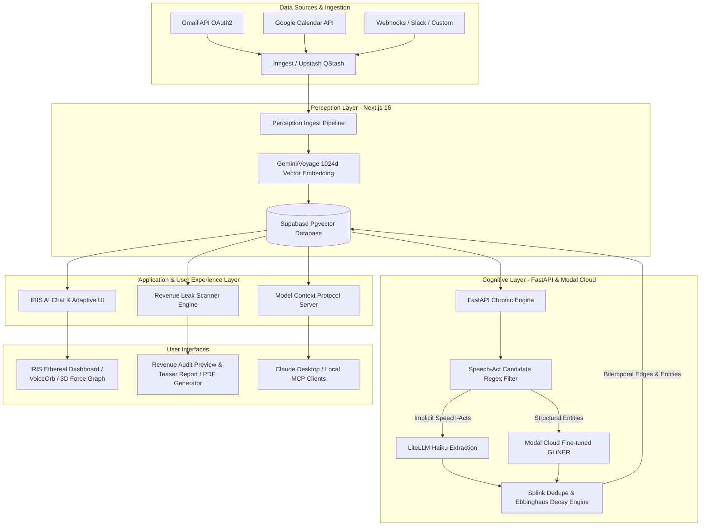

# EYES (Everything You Ever Said) — Comprehensive Deep Analysis & Architectural Audit Report

**Date:** July 24, 2026  
**System Identity:** EYES — Personal Knowledge Graph, Revenue Leak Auditing & Autonomous Cognitive AI Assistant (IRIS)  
**Target Codebase:** `e:\AI project\The EYES`  

---

## 1. Executive Summary

**EYES (Everything You Ever Said)** is a state-of-the-art, GDPR-native cognitive memory platform and enterprise revenue auditing tool. It securely ingests personal and corporate communications (Gmail, Calendar, Drive, Slack, Reddit), indexes them into a bitemporal vector graph database, and runs an intelligent speech-act extraction engine to discover unfulfilled commitments, delayed actions, lost deals, and key relationship entities.

The codebase is built on **Next.js 16 (React 19)**, **FastAPI (Python Chronic Engine)**, **Supabase PostgreSQL (with 1024d Pgvector & HNSW indexing)**, **LiteLLM Gateway / Anthropic / Gemini**, **Inngest**, **Upstash QStash**, and an **MCP (Model Context Protocol) Server**.

---

## 2. System Architecture & Component Interactions

---

## 3. Comprehensive Folder & File Structure Breakdown

### 📁 Root Directory Highlights
- `next.config.mjs` — Configured with Sentry wrapping, experimental server actions, security headers.
- `package.json` — Declares Next 16.2.2, React 19.2.4, `@xyflow/react` v12, `@modelcontextprotocol/sdk` v1.29, `@supabase/ssr`, `framer-motion`, `gsap`, `lenis`, `three-spritetext`, `jspdf`, `inngest`.
- `litellm_config.yaml` — Gateway routing configuration connecting to Anthropic Haiku, Gemini 1.5, and Voyage embedding endpoints.
- `push-env.ps1` — Utility script for synchronizing secrets across local, Vercel, and Supabase environments.

### 📁 `src/` Architecture

#### 1. `src/app/` (Next.js App Router)
- `revenue/` — Revenue Leak Scan system. Includes `page.tsx` (Teaser audit UI), `actions.ts` (Ingest, detect, report server actions), and `report/` (Full report unlock & receipt viewer).
- `iris/` — Flagship AI Assistant dashboard. Features tabbed views (`investigate`, `timeline`, `morning-brief`, `signals`, `mind-map`, `settings`) with dynamic theme support (Ember, Slate, Glassmorphism).
- `connect/` & `integrations/` — OAuth provider authorization flows for Google, Gmail, and Calendar.
- `api/` — 32 API route domains:
  - `api/revenue/` — Endpoints for starting leak scans, stream progress, generating reports.
  - `api/iris/v0/` — Core IRIS structured JSON response endpoint.
  - `api/inngest/` — Inngest background job receiver.
  - `api/mcp/` — Web-exposed MCP endpoints.
  - `api/cognitive/` — Triggers entity extraction, bitemporal graph construction, and Leiden community detection.

#### 2. `src/components/` (Modern UI System)
- `iris/` — `IrisHeader.tsx`, `IrisSidebar.tsx`, `AdaptiveCard.tsx`, `IntentCards.tsx`, `VoiceOrb.tsx` (real-time voice interaction & Web Speech API integration), `ReceiptPanel.tsx`, `AgentTerminal.tsx`.
- `dashboard/` — `KnowledgeGraph.tsx` (Interactive 3D force-directed node graph leveraging `react-force-graph-3d` and `three-spritetext`).
- `common/` & `layout/` — `GlassCard`, `PremiumButton`, `SmoothScroll` (Lenis implementation), navigation controls.

#### 3. `src/engine/` (Python Chronic Layer Subsystem)
- `main.py` — FastAPI service handling `/extract`, `/cron/dedupe`, `/cron/decay`, and candidate filter routing. Requires secret header authentication (`X-Engine-Secret`).
- `batch_dedupe.py` — Entity deduplication powered by Splink algorithms.
- `batch_decay.py` — Behavioral memory weight decay using the Ebbinghaus forgetting curve.
- `batch_leiden.py` — Community detection over entity-relationship graphs.
- `phase5_organs.py` — Higher-order organ synthesis for clustering thematic cognitive memories.

#### 4. `src/services/` (Backend Business Logic)
- `ai/` — `ai.ts` handling Voyage/Gemini 1024-dim embedding generation, prompt execution, and schema formatting.
- `audit/` — Revenue leak scanner business logic, thread parsing, receipt extraction, financial valuation.
- `auth/` — Token encryption/decryption routines (`tokens.ts`) securing OAuth access tokens at rest.
- `email/` — Ingestion logic for Gmail API threads and Resend email distribution.

#### 5. `src/mcp-server.ts` (Model Context Protocol)
- Full MCP Stdio server implementation allowing external LLMs (such as Claude Desktop) to query EYES memory (`search_memories`, `manage_calendar_event`, `get_recent_commitments`, `get_recent_memories`).

---

## 4. Subsystem Deep-Dive

### A. Revenue Leak Scan Audit System
1. **Ingest Phase:** Scans the last 182 days of Gmail threads. Filters for outbound proposals, price quotes, client inquiries, or unresolved commitments.
2. **Detection Engine:** Evaluates silent days, response status, and counterparty metadata. Extracts exact evidence quotes ("receipts").
3. **Valuation Engine:** Calculates potential pipeline risk in Euros (€) based on candidate deal sizes or user-defined placement fees (e.g. €7,000/deal).
4. **Teaser & PDF Generation:** Blurs non-preview receipts until unlocked, with automated PDF exports powered by `jspdf` / `pdfkit`.

### B. IRIS AI Assistant & Adaptive UI
1. **Speech-to-Speech & VoiceOrb:** Features a dynamic animated orb widget supporting Web Speech API transcription and voice synthesis.
2. **Structured JSON Output:** Enforces strict confidence scoring, temporal validity, intent categorization, and clickable source receipts.
3. **Multi-Theme Engine:** Seamlessly switches between Ember (vibrant orange glow), Slate, and Glassmorphism modes.

### C. Supabase Database & Migrations (59 Files)
- **Unified Memories Table (`029_unified_memories_table.sql`):** Stores cross-platform items with 1024d vector embeddings.
- **HNSW Vector Index (`017_add_hnsw_index.sql`, `032_embedding_1024_voyage.sql`):** Enables sub-millisecond similarity search across millions of memory embeddings.
- **Bitemporal Graph (`054_bitemporal_graph_trigger.sql`):** Tracks knowledge valid-time vs. transaction-time to allow historic query reconstruction without data destruction.
- **RLS & Security Policies (`003_data_lifecycle_rls_policies.sql`, `022_fix_rls_policies.sql`):** Enforces strict multi-tenant row-level isolation using `auth.uid()`.

---

## 5. Security & Code Quality Evaluation

| Feature / Module | Status | Audit Findings |
| :--- | :--- | :--- |
| **OAuth Token Security** | ✅ Passed | Access and refresh tokens encrypted at rest in `oauth_tokens` via AES-256 (`tokens.ts`). |
| **Engine API Security** | ✅ Passed | Python FastAPI protected with `X-Engine-Secret` header validation in `main.py`. |
| **Database Isolation** | ✅ Passed | RLS policies enforced across all tables (`memories`, `chat_threads`, `insights`). |
| **Vector Search Tuning** | ✅ Passed | Similarity threshold calibrated to `0.25` for 1024-dim cosine distance (`match_memories` RPC). |
| **Testing Coverage** | 🟡 Moderate | Vitest unit test suite and Playwright E2E present (`scripts/smoke-test.ts`, `e2e/`), recommended to expand coverage for Python engine. |

---

## 6. Key Strategic & Engineering Recommendations

1. **Production Deployment of Python Engine:** Deploy `src/engine/main.py` onto Modal / Fly.io / Render with environment variable `CHRONIC_ENGINE_SECRET` enforced.
2. **Automated Cron Scheduling:** Schedule `/cron/dedupe` and `/cron/decay` via Vercel Cron or Upstash QStash for nightly background maintenance.
3. **Expanded Test Suite:** Integrate CI/CD pipeline step running `npm run test` and `playwright test` on every pull request.
