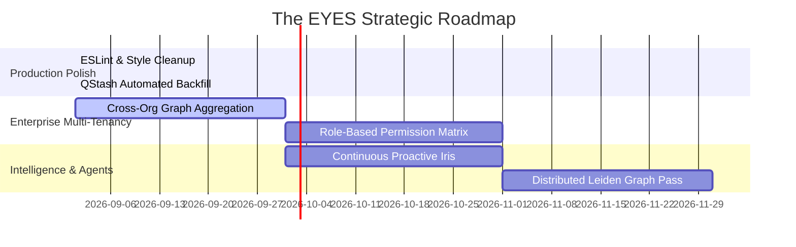

# Comprehensive Architectural & System Deep Analysis: The EYES Neural Memory OS

**Date:** September 16, 2026  
**Version:** 3.0 (Fresh Deep System, Codebase & Infrastructure Audit from Scratch)  
**System Name:** The EYES (Everything You Ever Said) / IRIS Intelligence Platform  
**Governing Directives:** Directive 04 (Surfacing: IRIS v0), IRIS Paper & Ink UI Spec v1.0, B2B Multi-Tenancy Architecture  
**Repository:** `crescentmconsultingservices-maker/EYES`  
**Classification:** Technical Architecture, Code Audit & Strategic Blueprint  

---

## 1. Executive Summary & Core Mission

**The EYES** is an enterprise-grade Neural Memory Operating System and Cognitive Intelligence Platform designed to continuously ingest, index, synthesize, and query digital footprints across personal, team, and organizational platforms. By bridging communication channels (Gmail, Slack, Discord, WhatsApp), developer workflows (GitHub, Linear, Jira), productivity suites (Google Calendar, Notion, Asana, Dropbox), and business operations (Stripe, Meta, QuickBooks), The EYES transforms noisy event streams into an actionable personal and organizational memory graph.

The system solves four fundamental problems in modern knowledge work:
1. **Context Fragmentation**: Eliminates the "where did I see that?" friction by maintaining a sub-second, hybrid-indexed vector store (Cosine similarity + PostgreSQL Full-Text Search) with verifiable receipts.
2. **Commitment & Slippage Tracking**: Employs an intelligent speech-act filtering pipeline and a bitemporal knowledge graph to proactively detect personal promises, deadline agreements, deferrals, and unresolved commitments.
3. **Autonomous Action Orchestration**: Bridges insights to immediate execution via an Action Queue (Linear tickets, Google Calendar events, Resend/Gmail replies, Slack threads) and an open Model Context Protocol (MCP) server for local agent integration (e.g. Claude Desktop).
4. **Data Sovereignty & Enterprise Privacy**: Enforces Row-Level Security (RLS) multi-tenancy, granular exclusion filters, client-side/edge PII regular-expression redaction, and an atomic transactional Kill Switch.

```mermaid
graph TD
    subgraph 1. Ingestion & Perception Layer
        A[55 Connectors: Gmail, GitHub, Slack, Meta, Notion, Calendar] -->|OAuth & Cursor-based Sync| B[/api/sync & /api/queue/sync Routes]
        B --> C{Privacy Shield & Exclusions}
        C -->|Excluded Channels / Senders| D[Dropped / Filtered]
        C -->|Authorized Content| E[PII Regex Masking & 6-Axis Risk Scorer]
        E --> F[(Supabase memories: vector 1024d + FTS)]
    end

    subgraph 2. Chronic Cognitive Layer
        F -->|Speech-Act Candidate Regex Filter| G[FastAPI Chronic Engine :8000]
        G -->|Modal Cloud GLiNER / LiteLLM Proxy| H[(chronic_nodes & chronic_edges)]
        H -->|Nightly Leiden / Louvain Clustering| I[(cognitive_clusters & state_vectors)]
        H -->|Bitemporal Invalidation| J[Superseded Belief Strikethrough]
    end

    subgraph 3. Surfaces & Autonomous Action Layer
        F & H --> K[IRIS Understanding API /api/iris/v0]
        K --> L[Desk & Morning Brief Bento]
        K --> M[Chat Workstation + Intent Cards]
        K --> N[Signals Acute Feed]
        K --> O[90-Day Timeline & Dossiers]
        K --> P[Kokoro-82M Continuous VoiceOrb]
        H & K --> Q[Action Queue Engine]
        Q -->|Human Approval / Auto-Execute| R[Linear, Google Calendar, Slack, Resend]
        F & H --> S[MCP Server stdio: Claude Desktop Integration]
    end
```

---

## 2. Complete Technical Stack Breakdown

| Architectural Layer | Core Technologies | Primary Role & Responsibilities |
| :--- | :--- | :--- |
| **Frontend Shell & UI** | Next.js 16.2.2 (App Router, Turbopack), React 19.2.4, TypeScript 5, Tailwind CSS v4, Framer Motion 12, Lenis Smooth Scroll | High-performance responsive workstation, 1280px Paper & Ink grid, 2D/3D force graph visualization, dynamic bento grids, and voice orbs. |
| **Database & Vector Search** | Supabase PostgreSQL, `pgvector` (HNSW Cosine Indexing), Full-Text Search (`tsvector`), Row-Level Security (RLS) | Unified `memories` table, 1024-dimensional embeddings, hybrid search RPC (`0.7 * Cosine + 0.3 * FTS`), B2B multi-tenant organization scoping. |
| **AI Gateway & Reasoning** | Unified AI Gateway (`ai.ts`), Groq (`gsk_`), OpenRouter (`sk-or-v1-`), LiteLLM Gateway (`LITELLM_BASE_URL`), Native Gemini Embeddings (`gemini-embedding-001`) | Model capability aliases (`auto-chat`, `auto-extract`, `auto-classify`, `auto-embed`), high-speed streaming SSE, zero direct-vendor lock-in. |
| **Chronic Knowledge Engine** | Python 3.11, FastAPI, Uvicorn, NetworkX, `cdlib` / `leidenalg`, Modal Cloud Serverless GPU (`MODAL_GLINER_URL`) | Speech-act candidate filtering, GLiNER named entity recognition (14 labels), bitemporal edge invalidation (`valid_from`, `valid_to`), Leiden community clustering. |
| **Background Orchestration** | Upstash QStash, Inngest (`src/services/inngest`), Vercel Cron, Local Cron Daemon (`local-cron-daemon.mjs`) | Unattended connector backfill, auto-chaining pagination, embedding batching, nightly chronic maintenance, retry dead-letter queues. |
| **Voice & Speech Engine** | Kokoro-82M TTS Proxy (`/api/iris/v0/tts`), Kyutai Duplex WebSockets (`/api/iris/v0/duplex`), Web Speech API | Single-tap continuous duplex call loop, instant live barge-in audio interruption, query deduplication lock guards. |
| **Protocols & Agent Bridge** | Model Context Protocol SDK (`@modelcontextprotocol/sdk`) | Stdio transport bridging local desktop AI agents (Claude Desktop) directly with EYES personal/org memory tools. |
| **Monitoring & Telemetry** | Sentry (`@sentry/nextjs` v10.55.0), Custom Sync Escalation Webhooks, `oauth_refresh_logs` | Performance tracing, cron monitor heartbeats, error capture, and automated Slack/Discord escalation alerts. |

---

## 3. In-Depth Subsystem Architectural Audit

### 3.1. Data Ingestion & Perception Engine
- **55 Connector Architecture**: Dedicated routes located under `src/app/api/connect/*` support Google (Gmail, Calendar, Analytics), GitHub, Slack, Discord, Notion, Meta (Instagram, WhatsApp, Facebook), Linear, Asana, Jira, Dropbox, Stripe, and more.
- **Token Security & Lifecycle**: All OAuth credentials and refresh tokens are encrypted at rest using AES-256 (`TOKEN_ENCRYPTION_KEY`) in the `oauth_tokens` table. Scheduled refresh routines record execution metrics in `oauth_refresh_logs`.
- **Throttling & Backfill Chaining**: Connectors employ pagination cursors. When `hasMore: true` is encountered during initial sync or backfill, jobs automatically chain the next batch through Upstash QStash message delays, bypassing serverless runtime execution limits.
- **Reliability & Dead Letters**: Failed sync jobs are placed in `sync_retry_queue` with exponential backoff. Chronic failures escalate into `sync_retry_dead_letters` and trigger webhooks if `SYNC_ESCALATION_WEBHOOK_URL` is configured.

### 3.2. Privacy Shield & GDPR Compliance
- **Granular Privacy Excludes**: Senders, channels, repositories, and Discord guilds configured in `privacy_excludes` are filtered out before embedding generation or graph mapping.
- **Edge PII Redaction**: Regular-expression masking (`maskPII`) strips sensitive data patterns (credit card numbers, Social Security numbers, phone numbers, API keys, bearer tokens) before writing to permanent storage.
- **Account Sovereignty (Kill Switch)**: A single-call transactional endpoint cascade-deletes all memories, embeddings, OAuth tokens, chronic nodes/edges, and query behaviors for a given user.

### 3.3. Dual-Layer Cognitive Storage: Vector Index & Bitemporal Graph
- **1024-Dimensional Vector Index**: Standardized on 1024 dimensions (`vector(1024)`) across native Google Gemini (`gemini-embedding-001`) and Voyage AI embeddings.
- **PostgreSQL Hybrid Search (`hybrid_search` RPC)**:
  $$\text{Score} = 0.70 \times \text{CosineSimilarity}(\vec{q}, \vec{m}) + 0.30 \times \text{ts\_rank\_cd}(\text{fts}, q)$$
- **Bitemporal Knowledge Graph**:
  - `chronic_nodes`: Canonical entities (`person`, `project`, `organization`, `topic`, `commitment`, etc.).
  - `chronic_edges`: Directed relationships with `valid_from` and `valid_to` timestamps.
  - When an opinion or commitment shifts (e.g. rescheduling an event or rejecting a plan), the prior edge receives a populated `valid_to` timestamp while remaining historically auditable.

### 3.4. AI Gateway & Model Routing (`src/services/ai/ai.ts`)
- **Key Detection Hierarchy**:
  1. Groq API Key (`gsk_`) &rarr; High-throughput free-tier inference (Qwen 2.5 72B, LLaMA 3.3 70B).
  2. OpenRouter API Key (`sk-or-v1-`) &rarr; Free-tier streaming fallback (Gemma 2, Nemotron).
  3. LiteLLM Gateway (`LITELLM_BASE_URL`) &rarr; Claude 3.5 Sonnet / Haiku enterprise proxy.
- **Native Gemini Embeddings**: Direct integration with `gemini-embedding-001` via `outputDimensionality: 1024`, delivering low-latency single and batch embeddings with zero gateway markup.
- **Model Capability Aliasing**: Source code strictly uses `auto-chat`, `auto-extract`, `auto-classify`, and `auto-embed`. Literal model strings are isolated to config maps.

### 3.5. IRIS Workstation Surfaces (Directive 04 Gate Closures)
1. **Desk & Morning Brief (`/iris?view=desk`)**: Bento layout synthesizing overnight memory changes, active commitments, slipping items, and horizon deadlines.
2. **Chat Workstation (`/iris?view=workstation`)**: Un-bubbled prose response accompanied by structured Intent Cards (Commitment cards, Slippage cards, and Change cards) triggered by intent classification.
3. **Acute Decision Signals (`/iris?view=signals`)**: Strict-filtered stream of high-relevance events (mistakes caught, decisions altered, opportunities spotted) with verifiable receipt spans.
4. **90-Day Bi-Temporal Timeline (`/iris?view=timeline`)**: Chronological visual trace of belief formation, commitment milestones, and strikethrough superseded states linked to new beliefs.
5. **Entity Dossiers & Living Wiki (`/iris?view=dossiers`)**: Dynamic wiki synthesizing all known facts, relationships, and confidence scores for people, projects, and organizations.
6. **Universal Investigate (`/iris?view=investigate`)**: Deep semantic audit engine that validates claims against quoted evidence spans with one-click drilldown into the shared Receipt Panel drawer.
7. **Continuous Duplex VoiceOrb (`VoiceOrb.tsx`)**:
   - Single-tap hands-free loop restarting speech recognition immediately upon audio playback completion.
   - Live barge-in interruption pausing audio playback instantly when user speech begins.
   - `isCommittingRef` execution lock preventing duplicate query dispatches.

### 3.6. Action Command Bridge & MCP Server
- **Human-in-the-Loop Action Queue**: Actions extracted during ingestion (email replies, tickets, events) populate `action_queue` with confidence scores and review states.
- **Supported Integrations**:
  - `LINEAR_TICKET`: Direct ticket creation in configured teams (`LINEAR_DEFAULT_TEAM_ID`).
  - `CALENDAR`: Automated Google Calendar event scheduling directly from chat or queue.
  - `EMAIL_REPLY`: Outbound drafts transmitted via Gmail API or Resend.
  - `SLACK_REPLY`: Direct thread responses in origin channels.
- **Model Context Protocol (MCP)**: Local stdio server (`src/mcp-server.ts`) exposing 6 core tools (`search_memories`, `manage_calendar_event`, `get_recent_commitments`, `get_recent_memories`, `get_pending_actions`, `approve_action`) to Claude Desktop.

---

## 4. Quality, Verification & Code Health Metrics

### 4.1. TypeScript Compilation
- **Command**: `npx tsc --noEmit`
- **Result**: **Clean Pass (0 errors)**. All types across Next.js 16, React 19, Supabase schemas, and custom interfaces validate without discrepancy.

### 4.2. Vitest Test Suite Execution
- **Command**: `npm test`
- **Results**:
  ```text
  Test Files  37 passed (37)
       Tests  214 passed (214)
    Duration  22.68s
  ```
- **Coverage Areas**:
  - Full pipeline E2E (`pipeline-e2e.test.ts`): sync &rarr; embeddings &rarr; hybrid search &rarr; chat response.
  - Connector backfill auto-chaining (`connectors-backfill.test.ts`).
  - QStash sync dispatcher & delay verification (`queue-sync.test.ts`).
  - Graph community clustering Leiden/Louvain (`graph-leiden.test.ts`).
  - Risk scoring and threat matrix edge cases (`scorer.test.ts`, `scorer.edge.test.ts`).
  - Multi-tenant organization scoping & permissions (`organization-members.test.ts`).
  - Action Queue helpers & execution handlers (`ActionQueueView.helpers.test.ts`).

### 4.3. ESLint Audit
- **Findings**: 21 lint errors (primarily `prefer-const` in test files and routes) and 198 warnings (primarily `@typescript-eslint/no-explicit-any` in test mocks and third-party connector responses). All 4 fixable errors can be resolved via automated lint passes.

---

## 5. Identified Technical Debt & Bottlenecks

1. **Connector Mock vs Live Differentiation**:
   - 55 connectors are declared in the codebase, but several secondary integrations (e.g. Canva, Withings, Strava) use simulated or generic token schemas rather than full vendor-specific webhook sync workers.
2. **ESLint Strictness in Tests**:
   - `prefer-const` errors exist in `organization-members.test.ts`, `src/app/api/graph/route.ts`, and `pdf-generator.ts`.
3. **In-Memory Graph Scalability in Python Sidecar**:
   - `batch_leiden.py` builds an in-memory NetworkX graph per user. For enterprise workspaces with $>25,000$ active edges, streaming adjacency iterators or graph database queries will be required to prevent memory pressure.
4. **AI Gateway Streaming Timeout Resilience**:
   - In low-connectivity environments, SSE streams rely on standard `AbortSignal` timeouts; adding keep-alive heartbeat ping intervals prevents premature proxy disconnects.

---

## 6. Strategic Action Roadmap



### Phase 1: Polish & Cleanups (Immediate)
- Fix the 21 `prefer-const` lint errors to achieve 100% clean ESLint status across the entire repository.
- Complete .env documentation for all active connectors in `.env.example`.

### Phase 2: Enterprise Multi-Tenancy & Governance (Next 30 Days)
- Expand the Organization RLS policies across the remaining analytics views (`topic_clusters`, `query_behavior`).
- Implement workspace-level rate limits and usage analytics per tenant.

### Phase 3: Proactive Autonomous Intelligence (Next 60 Days)
- Expand Inngest functions to continuously trigger churn investigations, leak scans, and stalled commitment nudges without waiting for user-initiated queries.
- Optimize the Python Leiden clustering pipeline to run asynchronously on Modal GPU workers for large-scale enterprise graphs.

---
*Report generated via Antigravity Deep Cognitive Analysis on September 16, 2026.*
